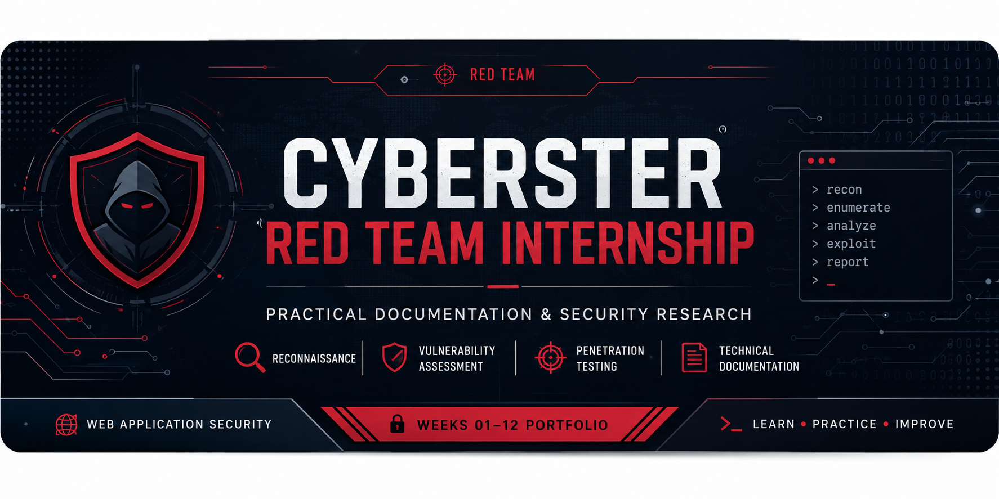

<p align="center">
  
</p>

<h1 align="center">Cyberster Red Team Internship</h1>

<p align="center">
Practical Documentation & Hands-on Learning Portfolio
</p>

This repository documents my practical work, methodologies, tools, and lessons learned throughout a **12-week Red Team Internship** at **Cyberster**.

The objective of this repository is not only to showcase completed tasks but also to demonstrate structured documentation, technical understanding, and continuous growth in Web Application Security and Penetration Testing.

---


</div>

---

# About This Repository

This repository serves as a technical portfolio documenting my progress throughout the Cyberster Red Team Internship.

Rather than uploading internship reports, I have transformed each week's work into structured technical documentation. Every module includes methodologies, commands, findings, challenges, and lessons learned to reflect practical cybersecurity skills.

---

# Internship Objectives

Throughout this internship I aim to:

- Develop practical Web Application Penetration Testing skills.
- Build strong reconnaissance and vulnerability assessment methodologies.
- Learn industry-standard offensive security tools.
- Understand the OWASP Top 10 through hands-on practice.
- Improve technical documentation and reporting.
- Build a professional cybersecurity portfolio.

---

# Skills Covered

## Reconnaissance

- Passive Reconnaissance
- Open Source Intelligence (OSINT)
- Google Dorking
- GitHub Dorking
- Attack Surface Mapping
- Infrastructure Profiling

## Web Application Security

- HTTP Fundamentals
- Burp Suite
- SQL Injection
- Cross-Site Scripting (XSS)
- File Upload Vulnerabilities
- XML External Entity (XXE)
- JWT Security
- CORS Misconfiguration

## Security Tools

- Kali Linux
- Burp Suite Community
- Nmap
- Subfinder
- Assetfinder
- Amass
- HTTPX
- Httprobe
- GoWitness
- WhatWeb
- ffuf
- Gobuster
- DNSDumpster

---

## Internship Progress

| Week | Module | Documentation |
|------|--------|---------------|
| Week 01 | Passive Reconnaissance & OSINT | ✅ [Open](Week-01-Passive-Reconnaissance/) |
| Week 02 | Vulnerability Assessment | 🚧 Coming Soon |
| Week 03 | Information Gathering & Enumeration | 🚧 Coming Soon |
| Week 04 | Web Application Penetration Testing | 🚧 Coming Soon |
| Week 05–12 | In Progress | ⏳ |

---

# Repository Structure

```text
Cyberster-RedTeam-internship
│
├── README.md
│
├── Week-01-Passive-Reconnaissance
│
├── Week-02-Vulnerability-Assessment
│
├── Week-03-Information-Gathering
│
├── Week-04-Web-Application-Pentesting
│
└── assets
```

---

# Weekly Documentation

Each week's documentation contains:

- Overview
- Learning Objectives
- Methodology
- Commands Used
- Findings
- Challenges
- Lessons Learned
- References
- Screenshots

---

# Current Progress

- Weeks Completed: **4 / 12**
- Practical Labs Completed
- Hands-on Documentation
- Professional Reporting
- Continuous Portfolio Development

---

# Disclaimer

This repository contains documentation created during the **Cyberster Red Team Internship** using authorized training environments and intentionally vulnerable applications for educational purposes.

No unauthorized testing or exploitation has been performed.

---

<div align="center">

### Cyberster Red Team Internship

**Learning • Practicing • Documenting • Improving**

</div>
