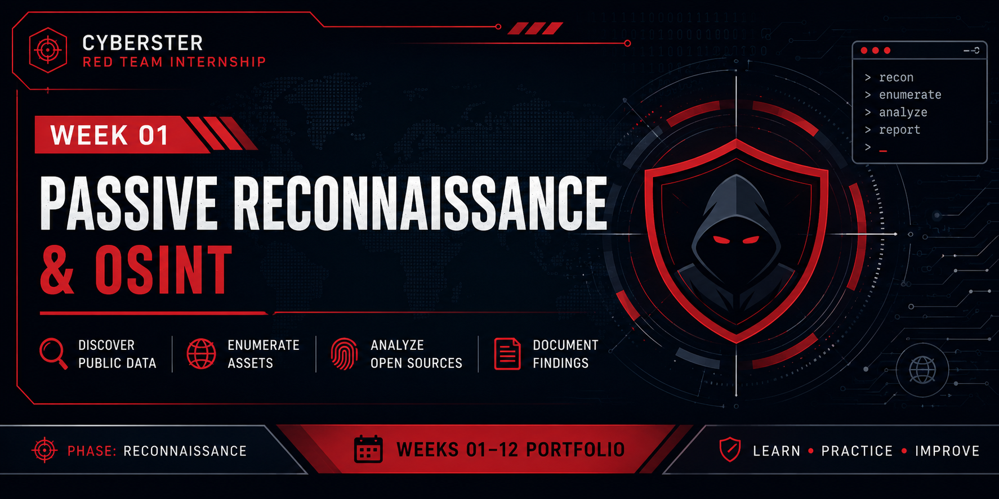

<p align="center">
  
</p>

# Week 01 – Passive Reconnaissance & OSINT

## Overview

The first week of the Cyberster Red Team Internship focused on **Passive Reconnaissance (OSINT)** against an authorized training target. The objective was to identify publicly available information, map the external attack surface, enumerate subdomains, profile the target infrastructure, and discover live assets without directly interacting with the target.

This engagement provided practical experience with industry-standard reconnaissance tools and demonstrated how multiple passive information sources can be combined to build a comprehensive understanding of a target before active security testing.

> **Target:** hackthissite.org  
> **Environment:** Kali Linux 2026.2  
> **Reconnaissance Type:** Passive (Non-Intrusive)

---

# Learning Objectives

During this week, I aimed to:

- Understand the fundamentals of Passive Reconnaissance.
- Perform Open Source Intelligence (OSINT) against an authorized target.
- Discover subdomains using multiple passive enumeration techniques.
- Profile infrastructure using publicly available information.
- Identify technologies running on web applications.
- Perform DNS and WHOIS analysis.
- Search for publicly exposed information using Google Dorking and GitHub Dorking.
- Validate live assets for future security assessments.

---

# Skills Developed

- Passive Reconnaissance
- Open Source Intelligence (OSINT)
- Attack Surface Mapping
- Subdomain Enumeration
- Infrastructure Profiling
- DNS Enumeration
- Technology Fingerprinting
- GitHub Dorking
- Google Dorking
- Live Asset Discovery
- Visual Reconnaissance

---

# Tools Used

| Category | Tools |
|-----------|-------|
| Operating System | Kali Linux 2026.2 |
| Passive Enumeration | Subfinder, Assetfinder, Amass |
| Certificate Transparency | CRT.sh |
| DNS Reconnaissance | DNSDumpster, dig, nslookup |
| Infrastructure Profiling | WHOIS |
| Technology Detection | WhatWeb, Wappalyzer |
| Live Host Discovery | HTTPX, Httprobe |
| Screenshot Collection | GoWitness |
| Search Techniques | Google Dorking, GitHub Dorking |

---

# Reconnaissance Workflow

```text
Target Selection
        │
        ▼
Passive OSINT
        │
        ▼
Subdomain Enumeration
        │
        ▼
Merge & Validate Results
        │
        ▼
Infrastructure Profiling
        │
        ▼
Technology Fingerprinting
        │
        ▼
GitHub & Google Dorking
        │
        ▼
Live Asset Discovery
        │
        ▼
Visual Reconnaissance
```

---

# Results Summary

| Activity | Result |
|----------|--------:|
| Passive Data Sources Used | 5 |
| Unique Subdomains Identified | 68 |
| Live Assets Confirmed | 34 |
| Screenshots Captured | 18 |
| Internship Tasks Completed | 4 |

---

# What I Learned

This week's activities reinforced several important reconnaissance concepts:

- Passive reconnaissance significantly reduces the risk of detection while collecting valuable intelligence.
- No single reconnaissance tool provides complete coverage; combining multiple sources improves accuracy.
- Infrastructure profiling helps identify technologies, hosting providers, and supporting services before active testing.
- Live asset validation allows security testing efforts to focus only on accessible targets.
- Proper documentation and organized workflows are essential for professional penetration testing engagements.

---

# Related Documentation

This week's documentation is organized into separate files for easier navigation.

| Document | Description |
|----------|-------------|
| methodology.md | Detailed reconnaissance methodology |
| commands.md | Commands executed during the engagement |
| findings.md | Technical findings and observations |
| lessons-learned.md | Challenges encountered and how they were resolved |

---

# Disclaimer

This work was completed as part of the **Cyberster Red Team Internship** on an **authorized training environment** for educational purposes only. No unauthorized testing or exploitation was performed.
