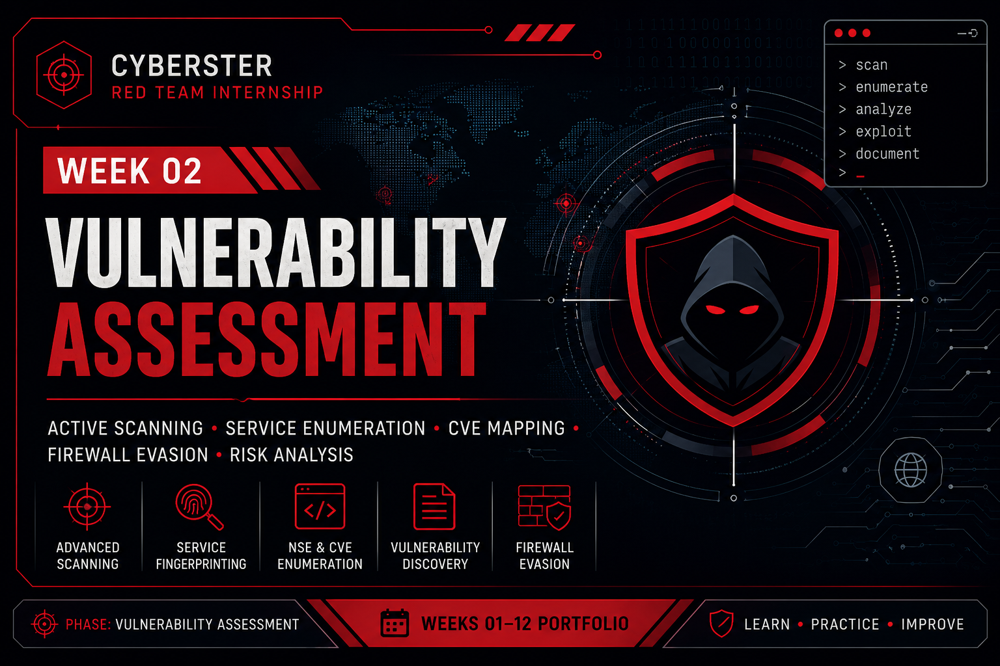

<p align="center">
  
</p>

# Week 02 – Vulnerability Assessment

## Overview

Week 02 focused on conducting an active vulnerability assessment against the Metasploitable 2 virtual machine within an authorized laboratory environment. The objective was to identify exposed services, perform detailed service fingerprinting, map discovered vulnerabilities to publicly known CVEs, and evaluate firewall evasion techniques using Nmap.

Unlike passive reconnaissance, this phase involved direct interaction with the target through controlled network scanning and enumeration activities while maintaining proper documentation of every assessment step.

---

# Learning Objectives

During this week, the following objectives were achieved:

- Understand active vulnerability assessment methodology.
- Perform TCP and UDP port scanning using Nmap.
- Compare different scan types and timing templates.
- Conduct service and version detection.
- Perform manual banner grabbing.
- Utilize Nmap Scripting Engine (NSE) for enumeration.
- Identify known vulnerabilities and associated CVEs.
- Evaluate firewall evasion techniques.
- Develop structured technical documentation and reporting.

---

# Lab Environment

| Component | Details |
|----------|---------|
| Operating System | Kali Linux |
| Target Machine | Metasploitable 2 |
| Virtualization | Oracle VirtualBox |
| Network Configuration | Host-Only Network |
| Assessment Type | Authorized Laboratory Environment |

---

# Assessment Scope

The assessment focused on evaluating the exposed attack surface of the Metasploitable 2 target through active network scanning, service enumeration, vulnerability identification, and firewall evasion testing.

Activities included:

- Port Discovery
- Service Enumeration
- Version Detection
- Banner Grabbing
- NSE Scripting
- CVE Mapping
- Firewall Evasion
- Technical Documentation

---

# Documentation

| Section | Link |
|---------|------|
| Methodology | [View](methodology.md) |
| Commands | [View](commands.md) |
| Findings | [View](findings.md) |
| Lessons Learned | [View](lessons-learned.md) |

---

# Assessment Workflow

```text
Target Preparation
        │
        ▼
Host Discovery
        │
        ▼
TCP & UDP Port Scanning
        │
        ▼
Service & Version Detection
        │
        ▼
Banner Grabbing
        │
        ▼
NSE Enumeration
        │
        ▼
CVE Mapping
        │
        ▼
Firewall Evasion Testing
        │
        ▼
Documentation & Reporting
```

---

# Tools Used

## Network Scanning

- Nmap
- Netcat (NC)

## Enumeration

- Enum4linux
- Nmap Scripting Engine (NSE)

## Network Analysis

- TCP Connect Scan
- SYN Stealth Scan
- UDP Scan
- Version Detection
- Aggressive Scan

## Firewall Evasion

- Packet Fragmentation
- MTU Manipulation
- Decoy Scanning
- Source Port Spoofing

---

# Skills Developed

Throughout this assessment, the following practical skills were strengthened:

- Active Network Scanning
- Service Fingerprinting
- Banner Analysis
- Vulnerability Enumeration
- CVE Identification
- NSE Script Utilization
- Firewall Evasion Techniques
- Technical Reporting
- Risk Assessment
- Lab Troubleshooting

---

# Repository Structure

```text
Week-02-Vulnerability-Assessment
│
├── README.md
├── methodology.md
├── commands.md
├── findings.md
├── lessons-learned.md
└── images
    ├── README.md
    └── week-02-banner.png
```

---

# References

- Nmap Documentation
- Nmap Scripting Engine (NSE)
- CVE Database
- Metasploitable 2 Documentation
- Cyberster Internship Training Material

---

# Week Summary

This week's assessment demonstrated how active scanning techniques can be used to identify exposed services, enumerate software versions, discover publicly known vulnerabilities, and evaluate network defenses within a controlled environment.

The practical experience gained during this phase establishes the foundation for future exploitation and web application penetration testing activities.

---

# Next Week

**Week 03 – Information Gathering & Enumeration**

The next phase will focus on expanding target intelligence through advanced enumeration techniques, web content discovery, and attack surface mapping to prepare for web application security testing.
