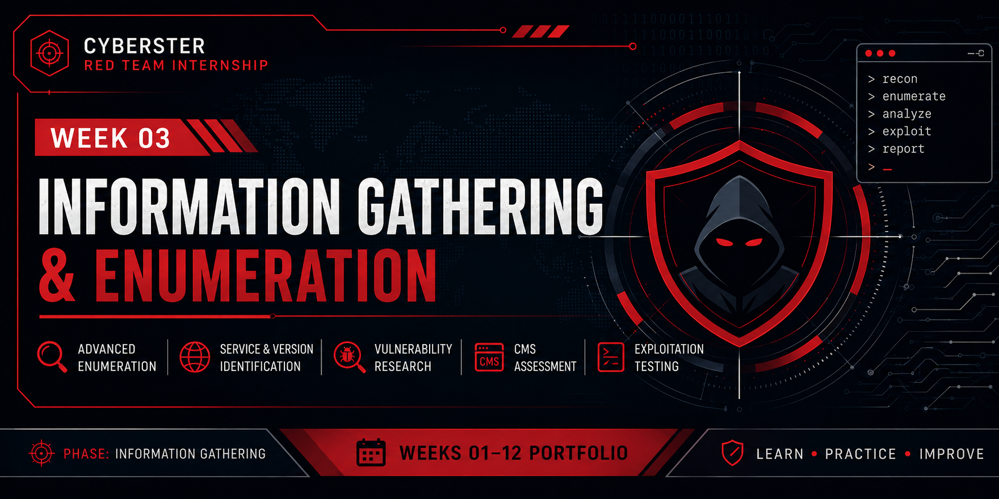

<p align="center">
  
</p>

# Week 03 – Vulnerability Assessment, Initial Exploitation & Web Application Penetration Testing

  

## Overview

Week 3 of the Cyberster Red Team Internship shifted from passive information gathering into **active enumeration, vulnerability research, and controlled exploitation**. The engagement covered advanced web directory and parameter discovery, CVE mapping against identified services, CMS security assessment of WordPress and Joomla, and hands-on exploitation using the Metasploit Framework.

Unlike Week 1's passive-only scope, this week involved direct interaction with target systems, including a Docker-hosted WordPress and Joomla environment and the intentionally vulnerable Metasploitable 2 machine. All active testing was restricted to isolated lab systems and an authorized training platform.

> **Target:** Metasploitable 2, VulnerableWordPress (Docker), Joomla (Docker), hackthissite.org
> **Environment:** Kali Linux, VirtualBox Host-Only Network
> **Engagement Type:** Vulnerability Assessment, CMS Security Assessment, Controlled Exploitation

**Key Outcome:** Achieved remote code execution and a root-level shell on Metasploitable 2 via the Samba `usermap_script` vulnerability, following two unsuccessful exploitation attempts against vsftpd and UnrealIRCd.

---

# Learning Objectives

During this week, I aimed to:

- Perform advanced web directory and hidden parameter discovery.
- Map discovered service versions to known CVEs.
- Research publicly available exploits using Searchsploit, NVD, and Exploit-DB.
- Understand the importance of validating exploitability before assuming success.
- Deploy vulnerable WordPress and Joomla environments using Docker.
- Perform CMS security assessments using WPScan and JoomScan.
- Gain hands-on experience with the Metasploit Framework.
- Achieve and verify remote command execution on a controlled target.
- Strengthen documentation and reporting practices for exploitation activities.

---

# Skills Developed

- Web Directory & Parameter Discovery
- Hidden Parameter Enumeration
- CVE Mapping & Exploit Research
- Vulnerability Validation
- CMS Security Assessment (WordPress & Joomla)
- Metasploit Framework Navigation
- Exploit Module Selection & Configuration
- Reverse Shell Handling
- Docker Deployment & Container Management
- Post-Exploitation Verification
- Technical Documentation of Exploitation Activities

---

# Tools Used

| Category | Tools |
|-----------|-------|
| Operating System | Kali Linux |
| Directory & Parameter Discovery | FFUF, Dirsearch, Gobuster, Arjun, ParamSpider |
| Vulnerability Research | Searchsploit, NVD, Exploit-DB |
| CMS Security Assessment | WPScan, JoomScan |
| Exploitation | Metasploit Framework, Netcat |
| Environment Management | Docker, Git |
| Web Analysis | WhatWeb, Nikto |

---

# Assessment Workflow

```text
Reconnaissance (Service Versions)
        │
        ▼
Web Directory & Parameter Enumeration
        │
        ▼
CVE Mapping & Exploit Research
        │
        ▼
CMS Security Assessment
        │
        ▼
Controlled Exploitation
        │
        ▼
Post-Exploitation Verification
        │
        ▼
Documentation
```

---

# Results Summary

| Activity | Result |
|----------|--------:|
| Directory/Parameter Discovery Tools Used | 5 |
| CMS Platforms Assessed | 2 |
| Exploits Attempted | 3 |
| Successful Exploits | 1 |
| Highest Severity Finding | Critical – RCE via Samba `usermap_script` |
| Internship Tasks Completed | 4 |

---

# What I Learned

This week's activities reinforced several important offensive security concepts:

- Matching a service version to a known exploit does not guarantee successful exploitation; the target environment must still be validated, as demonstrated by the failed vsftpd and UnrealIRCd attempts against a confirmed successful Samba exploit.
- Failed exploitation attempts are still valuable, as they demonstrate correct verification practices and improve understanding of exploitability conditions.
- Directory and parameter brute-forcing frequently reveals attack surfaces not visible from the main application interface.
- CMS platforms such as WordPress and Joomla often expose usernames, debug logs, and configuration backups through default or misconfigured settings.
- A successful shell is only the beginning of an assessment; verifying access level and system context is essential before drawing conclusions.

---

# Related Documentation

This week's documentation is organized into separate files for easier navigation.

| Document | Description |
|----------|-------------|
| methodology.md | Detailed assessment methodology |
| commands.md | Commands executed during the engagement |
| findings.md | Technical findings and observations |
| lessons-learned.md | Challenges encountered and how they were resolved |

---

# Disclaimer

This work was completed as part of the **Cyberster Red Team Internship** on **authorized lab environments and an authorized training platform** for educational purposes only. No unauthorized testing or exploitation was performed.
