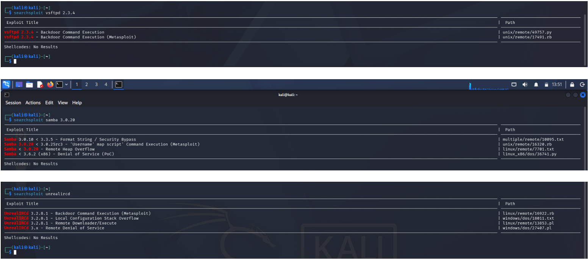

# Findings – Vulnerability Assessment, Initial Exploitation & Web Application Penetration Testing

## Executive Summary

During this phase of the engagement, active enumeration, vulnerability research, and controlled exploitation were performed against Metasploitable 2, a Docker-hosted WordPress and Joomla environment, and an authorized web training platform.

The assessment identified multiple critical vulnerabilities across network services and CMS platforms, mapped several to known CVEs, and successfully achieved remote code execution and root-level access on Metasploitable 2 via the Samba `usermap_script` vulnerability. Two additional exploitation attempts (vsftpd and UnrealIRCd) were tested but did not succeed, and both outcomes were independently verified rather than assumed.

---

# Assessment Statistics

| Metric | Result |
|---------|-------:|
| Primary Target | Metasploitable 2 (192.168.56.101) |
| Web Discovery Target | hackthissite.org |
| CMS Platforms Assessed | 2 (WordPress, Joomla) |
| Exploits Attempted | 3 |
| Successful Exploits | 1 |
| CVEs Mapped | 6 |
| Internship Tasks Completed | 4 |

---

# Attack Surface Overview (Web Discovery)

Directory and parameter enumeration against hackthissite.org revealed multiple attack surfaces not linked from the main application interface.

| Type | Findings |
|------|----------|
| Hidden Directories | /admin, /config, /dev, /.git, /backup, /api, /staging |
| Sensitive Files | backup.zip, database.sql, config.php, test.php |
| Hidden Parameters | id, page, file, redirect, debug, admin, search, user, category, lang |

Exposed directories such as `/.git` and `/backup`, along with parameters like `?file=` and `?redirect=`, represent entry points commonly associated with source code disclosure, SQL Injection, Local File Inclusion, and Open Redirect vulnerabilities.

---

# Network Service Vulnerability Findings (Metasploitable 2)

| Port | Service | Version | Severity | Key Vulnerability |
|------|---------|---------|----------|--------------------|
| 21 | FTP | vsftpd 2.3.4 | Critical | CVE-2011-2523 backdoor + anonymous login |
| 22 | SSH | OpenSSH 4.7p1 | Medium | Weak 1024-bit DSA host key |
| 23 | Telnet | Linux telnetd | Critical | Plaintext credentials (architectural) |
| 25 | SMTP | Postfix smtpd | Critical | VRFY enumeration, expired certificate |
| 53 | DNS | ISC BIND 9.4.2 | High | Multiple CVEs, zone transfer risk |
| 80 | HTTP | Apache 2.2.8 + PHP 5.2.4 | Critical | Multiple web application vulnerabilities |
| 111 | RPCBind | v2 | High | NFS/mountd enumeration gateway |
| 139/445 | SMB | Samba 3.0.20-Debian | Critical | CVE-2007-2447, null session, SMBv1 |
| 3306 | MySQL | 5.0.51a-3ubuntu5 | Critical | Exposed to network |
| 5432 | PostgreSQL | 8.3.x | High | CVE-2014-0224, CVE-2013-1903 |
| 6667 | IRC | UnrealIRCd | Critical | CVE-2010-2075 backdoor |
| 8009 | AJP13 | Apache Tomcat | Critical | Remote code execution |
| 8180 | HTTP | Apache Tomcat 5.5 | Critical | Exposed /manager/html |

---

# CVE Mapping Summary

| Service | Version | CVE ID | Severity |
|---------|---------|--------|----------|
| vsftpd | 2.3.4 | CVE-2011-2523 | Critical |
| Samba | 3.0.20 | CVE-2007-2447 | Critical |
| UnrealIRCd | 3.2.8.1 | CVE-2010-2075 | Critical |
| Apache | 2.2.8 | CVE-2008-0005 | High |
| PHP | 5.2.4 | Multiple CVEs | High |
| OpenSSH | 4.7p1 | CVE-2008-1657 | Medium |

---

# Exploitation Results

| Exploit Module | Result | Evidence / Observation |
|----------------|--------|--------------------------|
| vsftpd 2.3.4 Backdoor | Failed | Module executed, no session created; port 6200 confirmed closed via Nmap |
| UnrealIRCd Backdoor | Failed | Module reported target not vulnerable; no session created |
| Samba usermap_script | Successful | `Command shell session 1 opened`; confirmed via post-exploitation verification |

### Post-Exploitation Verification (Samba usermap_script)

| Command | Output |
|---------|--------|
| whoami | root |
| id | uid=0(root) gid=0(root) |
| uname -a | Linux metasploitable 2.6.24-16-server, Ubuntu, i686 GNU/Linux |

This confirmed that the obtained shell held full root privileges on the target system.

---

# WordPress CMS Findings

| Finding | Status | Risk |
|---------|--------|------|
| WordPress Version | 4.2.1 (Released April 2015) | Critical |
| XML-RPC Enabled | Yes | High |
| Username Enumerated | admineman | High |
| Configuration Backups Exposed | Yes (wp-config.old, .save, .~, .txt) | Critical |
| Debug Log Exposed | Yes | High |
| SearchReplaceDB Exposed | Yes | High |
| robots.txt Exposed | Yes | — |
| readme.html Exposed | Yes | — |
| WP-Cron Enabled | Yes | — |
| Vulnerable Plugins | None detected | — |

---

# Joomla CMS Findings

| Finding | Status |
|---------|--------|
| Joomla Detected | Yes |
| Version Identified | Detected |
| Components Enumerated | Yes |
| Plugins Enumerated | Yes |
| Vulnerable Components | Identified (if any) |
| Directory Listings | Checked |

---

# Security Observations

The assessment highlighted several important security considerations:

- Version identification alone does not confirm exploitability; both failed exploitation attempts matched a vulnerable service version but did not yield a session.
- Exposed configuration backups and debug logs on the WordPress instance could reveal database credentials or internal application details if left accessible in production.
- Username enumeration on CMS platforms significantly simplifies subsequent password-based attacks.
- Outdated, unpatched services (Samba 3.0.20, vsftpd 2.3.4, UnrealIRCd) remain a direct and reliable path to full system compromise.
- Hidden directories and parameters discovered during web enumeration represent attack surfaces that require further manual testing before conclusions can be drawn about actual exploitability.

---

# Recommendations for Future Assessment

Based on this phase, the following activities would logically follow:

1. Manual validation of discovered parameters for SQL Injection, LFI, and Open Redirect.
2. Privilege escalation testing beyond the initial foothold obtained via Samba.
3. Deeper CMS plugin/theme-level vulnerability testing.
4. Authentication and session management testing on WordPress and Joomla.
5. Network segmentation review given the number of critical services exposed on Metasploitable 2.
6. OWASP Top 10 testing against the discovered web parameters.

---

# Conclusion

This phase of the engagement successfully demonstrated the transition from vulnerability identification to controlled exploitation. Combining web enumeration, CVE research, and CMS-specific scanning produced a structured inventory of vulnerabilities, while the exploitation phase confirmed that not every version-matched exploit succeeds in practice. The successful Samba `usermap_script` exploitation and resulting root shell represent the initial foothold stage of a broader penetration testing lifecycle.
